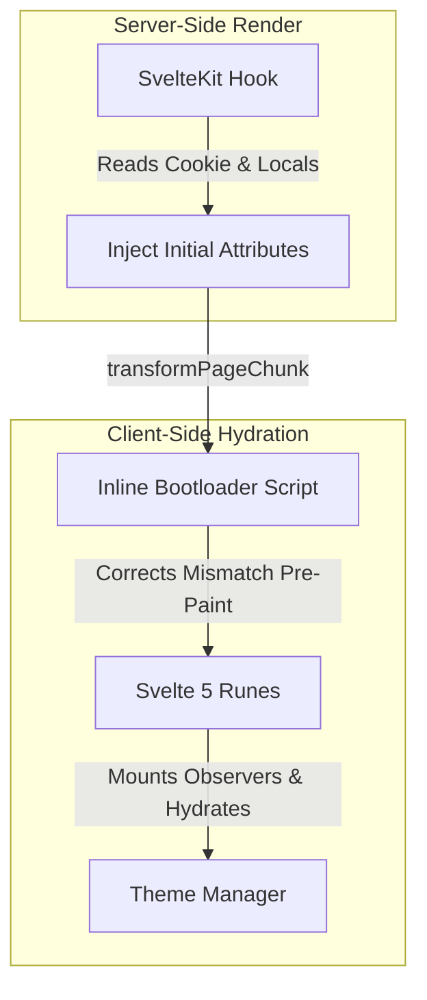

# 🌗 sv-themes

**SSR-safe Svelte 5 theme management library with advanced features like tab sync, FOUC prevention, scoped overrides, and more.**

[](https://www.npmjs.com/package/sv-themes)
[](https://opensource.org/licenses/MIT)
[](https://github.com/Ventriix/sv-themes)

A type-safe theme management library designed for **Svelte 5** and **SvelteKit**. Rather than basic class toggling, `sv-themes` coordinates states across the SvelteKit server lifecycle and Svelte 5 client-side components to resolve common theme challenges like handling system preferences, storage fallbacks, cross-tab syncing, and nested theme overrides without hydration mismatches or layout flickers.

## Features

- **SSR-Safe:** Prevents initial light/dark flashes (FOUC) by synchronizing theme attributes with the server and injecting an inline head bootloader.
- **Svelte 5 Runes:** Built natively with Svelte 5 runes.
- **Scoped Theme Overrides:** Declare forced themes in nested routes with priority matching, child locks, and automated unmount cleanup.
- **Tab Synchronization:** Listens to global storage events to instantly align multiple open browser tabs.
- **Robust Persistence:** Coordinates fallback strategies across cookies, `localStorage`, and `sessionStorage`.
- **Comprehensive Testing:** Over 95% test coverage, covering all error paths and edge cases.

---

## 🏗️ Architecture



---

## 📦 Installation

```bash
# npm
npm install sv-themes

# pnpm
pnpm add sv-themes

# yarn
yarn add sv-themes

# bun
bun add sv-themes
```

---

## 🛠️ Defining Themes

Before initializing the manager, define your themes using the `createThemes` helper. This utility maps an array of theme configurations into a strongly typed `ThemeRecord`.

```typescript
import { createThemes, type Theme } from "sv-themes";

export const APP_THEMES = createThemes([
	{ id: "light", type: "light", color: "#fff" },
	{ id: "dark", type: "dark", color: "#000" },
	{ id: "nature", type: "light", className: "theme-nature", color: "var(--nature, green)" }
]);
```

> [!TIP]
> **Flexible Color Values:** The `color` property supports standard CSS names (e.g., `green`), HEX codes (e.g., `#fff`), and CSS custom properties (variables) with optional fallbacks (e.g., `var(--nature, green)`).

### Types

```typescript
export interface Theme {
	id: string;
	className?: string;
	type: "light" | "dark";
	color?: string;
}

export type ThemeRecord<Keys extends string = string> = Record<Keys, Readonly<Theme>>;
```

> [!WARNING]
> **Duplicate Theme IDs:** If multiple themes share the same `id` within `createThemes`, the last theme in the array will overwrite the previous ones.

---

## 🚀 Quick Start

> [!NOTE]
> **Looking for an example?** You can find a fully configured SvelteKit implementation in the [packages/demo](https://github.com/Ventriix/sv-themes/tree/main/packages/demo) directory of the repository.

### 1. Create Theme Manager (`src/lib/theme-manager.svelte.ts`)
Set up your canonical theme configurations and instantiate the manager.

```typescript
import { createAppThemeManager, DEFAULT_THEMES } from "sv-themes";

export const { themeManager, registerThemeManager } = createAppThemeManager({
	themes: DEFAULT_THEMES,
	initialTheme: "light",
	systemThemes: {
		kind: "enabled",
	},
	useSystemTheme: true,
}).match(
	(result) => result,
	(errors) => {
		// Throw returned errors with their messages
		throw new Error(JSON.stringify(errors.map((error) => error.message)));
	},
);
```

### 2. Server Middleware (`src/hooks.server.ts`)
Intercept SvelteKit’s SSR lifecycle to inject resolved state directly into the HTML markup.

```typescript
import { createThemeHandle } from "sv-themes/kit";
import { themeManager } from "$lib/theme-manager.svelte"; // Your shared manager instance

export const handle = createThemeHandle(themeManager);
```

> [!TIP]
> **CSP Nonce Support:** If your application enforces a Content Security Policy (CSP), you can provide a script nonce to the inline head bootloader in two ways:
> 1. Set `event.locals.svThemesScriptNonce` in SvelteKit's request cycle.
> 2. Pass it directly as the second parameter: `createThemeHandle(themeManager, cspNonce)`.
> 
> To support the `event.locals` approach with TypeScript, extend SvelteKit's global interface in your `src/app.d.ts`:
> ```typescript
> declare global {
> 	namespace App {
> 		interface Locals {
> 			svThemesScriptNonce?: string;
> 		}
> 	}
> }
> ```

### 3. Root Layout Orchestration (`src/routes/+layout.svelte`)
Mount the manager to handle client-side hydration, media listeners, and tab sync.

```svelte
<script lang="ts">
	import { registerThemeManager } from "$lib/theme-manager.svelte";
	
	let { children } = $props();

	// Bootstraps runtime effects and event listeners
	registerThemeManager();
</script>

{@render children()}
```

### 4. Toggle Component
Update your Svelte state directly.

```svelte
<script lang="ts">
	import { themeManager } from "$lib/theme-manager.svelte";
</script>

<button onclick={() => themeManager.setTheme('light')}>Light</button>
<button onclick={() => themeManager.setTheme('dark')}>Dark</button>
<button onclick={() => themeManager.setTheme('system')}>System</button>

<p>Theme: {themeManager.resolvedTheme}</p>
```

---

## 📖 API Reference

### `ThemeManager<Themes>` Interface

The object returned by the `createThemeManager` factory. Properties marked with **Rune** are reactive under Svelte 5 and can be read directly in Svelte components to trigger reactive UI updates.

| Property | Type | Access | Description |
| :--- | :--- | :--- | :--- |
| `themes` | `Themes` | Readonly | The canonical record of registered theme configurations. |
| `themeIds` | `(keyof Themes)[]` | Readonly | An array of all registered theme IDs. |
| `systemThemes` | `SystemThemes<Themes>` | Readonly / Getter | The active system theme configuration, containing the mapped system themes and a reactive getter for the current OS `systemTheme` (`"light" \| "dark" \| undefined`). |
| `useSystemTheme` | `boolean` | **Rune** (Getter) | Indicates whether the user's preference is set to follow system OS settings. |
| `resolvedUseSystemTheme` | `boolean` | **Rune** (Getter) | Derived state determining if system preferences are actively shaping the current theme (resolves to true if system themes are enabled and either no theme is forced with useSystemTheme active, or `forcedTheme` is set to `"system"`). |
| `hasLightTheme` | `boolean` | Readonly | Boolean flag indicating if any registered theme is of type `"light"`. |
| `hasDarkTheme` | `boolean` | Readonly | Boolean flag indicating if any registered theme is of type `"dark"`. |
| `initialTheme` | `keyof Themes` | Readonly | The default theme ID specified during configuration. |
| `resolvedTheme` | `keyof Themes` | **Rune** (Getter) | Derived state containing the active computed theme ID (Priority: Forced > System OS > Selected). |
| `selectedTheme` | `keyof Themes` | **Rune** (Getter) | The currently active user-selected theme ID (ignoring any temporary forced states). |
| `isForcedThemeLocked` | `boolean` | **Rune** (Getter/Setter) | Flag indicating if a layout has locked the forced state against deeper nested overrides. |
| `forcedTheme` | `keyof Themes \| "system"` | **Rune** (Getter) | The current temporary forced theme ID, if set. |
| `useColorScheme` | `boolean` | Readonly | If active, synchronizes the CSS `color-scheme` rule on the root element. It also automatically manages the `<meta name="color-scheme">` HTML element, dynamically resolving its content to `'light dark'`, `'dark light'`, `'light'`, or `'dark'` based on the types and order of your registered themes. |
| `useThemeColor` | `boolean` | Readonly | If active, dynamically updates `<meta name="theme-color">` using theme colors. |
| `isThemeForcedAttribute` | `string` | Readonly | Attribute set on `<html>` when a forced theme is active. |
| `isSystemThemeAttribute` | `string` | Readonly | Attribute set on `<html>` when system preference is active. |
| `storage` | `StorageOptions` | Readonly | Persistence configuration detailing storage methods, keys, and cookie configurations. |
| `enableTabSync` | `boolean` | Readonly | Whether cross-tab synchronization via storage events is active. |
| `attributes` | `ThemeAttribute[]` | Readonly | Array of HTML attributes (e.g., `'class'`, `'data-theme'`) to manipulate on the target element. |
| `enableLogging` | `boolean` | Readonly | Whether to log to console. |

#### Public Methods

```typescript
/**
 * Sets the active user theme preference.
 * Triggers events, runs validations, and persists the result to your enabled storage methods.
 */
setTheme(
    theme: keyof Themes | "system", 
    shouldPersist?: boolean
): ResultAsync<void, ThemeManagerError>;

/**
 * Declares a temporary forced theme override. 
 * If shouldLock is set to true, it locks the layout hierarchy against deeper sub-route overrides.
 */
setForcedTheme(
    theme?: keyof Themes | "system", 
    shouldLock?: boolean
): ResultAsync<void, ThemeManagerError>;

/**
 * Registers an event listener on the theme transition lifecycle.
 * Returns an unsubscription/cleanup function.
 */
on<Event extends keyof ThemeManagerEvents<Themes>>(
    event: Event,
    handler: Listener<ThemeManagerEvents<Themes>[Event]>
): () => void;
```

---

### `createThemeManager<Themes>(config)`

Instantiates your Svelte 5 reactive theme manager. It performs structural normalization and validations upon initialization, returning a `Result` container from `neverthrow`.

```typescript
import { createThemeManager } from "sv-themes";

export const themeManager = createThemeManager({
	themes: DEFAULT_THEMES,
	initialTheme: "light",
	systemThemes: {
		kind: "enabled",
	},
	useSystemTheme: true,
}).match(
	(result) => result,
	(errors) => {
		// Throw returned errors with their messages
		throw new Error(JSON.stringify(errors.map((error) => error.message)));
	},
);
```

> [!NOTE]
> **SvelteKit / Svelte Application Layouts:** If you are building a SvelteKit app, prefer using `createAppThemeManager` instead. It wraps the manager creation, handles Svelte context setup, and registers DOM synchronization automatically, reducing boilerplate in your root layout.

#### Configuration Options (`ThemeManagerConfig<Themes>`)

| Property | Type | Default | Description |
| :--- | :--- | :--- | :--- |
| `themes` | `Themes` | *Required* | The record of registered theme objects of type `ThemesRecord`. |
| `initialTheme` | `keyof Themes` | *Required* | The fallback/default theme ID to fall back on during initialization. |
| `systemThemes` | `SystemThemesConfig<Themes>` | `{ kind: "disabled" }` | Setup indicating if system themes are `"disabled"` or `"enabled"`. The `mappings` field is a `Partial<Record<SystemTheme, keyof Themes>>` and automatically resolves to the first registered light and dark themes in your `themes` record if omitted. |
| `useSystemTheme` | `boolean` | `true` | Tracks whether the user preference is set to follow the OS. |
| `forcedTheme` | `keyof Themes \| "system"` | `undefined` | The initial forced theme value, if any. |
| `isForcedThemeLocked` | `boolean` | `false` | Initial locked state of forced themes. |
| `useColorScheme` | `boolean` | `true` | Synchronizes the browser's CSS `color-scheme` rule. |
| `useThemeColor` | `boolean` | `true` | Dynamically updates `<meta name="theme-color">` using theme colors. |
| `isThemeForcedAttribute` | `string` | `"data-is-theme-forced"` | Attribute name set on `<html>` when a forced theme is active. |
| `isSystemThemeAttribute` | `string` | `"data-is-system-theme"` | Attribute name set on `<html>` when system theme is active. |
| `storage` | `StorageOptions` | See below | Configuration details for storage syncing and persistence. |
| `enableTabSync` | `boolean` | `true` | Active state of cross-tab synchronization. Requires either `"localStorage"` or `"sessionStorage"` in storage methods. |
| `attributes` | `ThemeAttribute[]` | `["class", "data-theme"]` | Array of DOM targets to manipulate on the root. |
| `enableLogging` | `boolean` | `process.env.NODE_ENV === "production"` | Enables console error logging during standard operation. |

#### Storage Defaults

If the `storage` configuration is omitted, it defaults to:

```typescript
{
  methods: ["cookie", "localStorage"],
  key: "theme",
  cookie: {
    name: "theme",
  }
}
```

---

### `createAppThemeManager<Themes>(config)`

An all-in-one helper designed specifically for SvelteKit and Svelte 5 application layouts. It wraps both the manager instantiation and DOM/Context registration.

```typescript
import { createAppThemeManager, DEFAULT_THEMES } from "sv-themes";

export const { themeManager, registerThemeManager } = createAppThemeManager({
	themes: DEFAULT_THEMES,
	initialTheme: "light",
	systemThemes: {
		kind: "enabled",
	},
	useSystemTheme: true,
}).match(
	(result) => result,
	(errors) => {
		// Throw returned errors with their messages
		throw new Error(JSON.stringify(errors.map((error) => error.message)));
	},
);
```

> [!WARNING]
> **Context Collision:**
> `registerThemeManager` runs checks to prevent Svelte context collisions. It will refuse to register and return a `ThemeManagerError` if:
> - **`AlreadyRegistered`**: Another theme manager is already registered upstream in Svelte's context hierarchy. Ensure you only call `registerThemeManager` once at your root layout level.

---

### 🛡️ Runtime Validations & Safety

`createThemeManager` runs rigorous defensive validations to protect your application state from becoming poisoned. It will refuse to initialize and return a `ThemeManagerError` array if:
- **`NoThemes`**: The `themes` configuration object has no keys.
- **`ThemeInvalidId`**: A theme uses `"system"` as its ID (reserved keyword).
- **`ThemeNotFound`**: The `initialTheme` does not exist in the `themes` configuration.
- **`SystemThemesDisabled`**: System theme detection is active (`useSystemTheme` is true) but system themes are explicitly `"disabled"`.
- **`SystemThemeUnassigned`**: System themes are `"enabled"`, but there is no valid light/dark mapping configured or auto-detected.
- **`SystemThemeInvalidType`**: A system theme is mapped to an ID whose theme type does not match its target OS type (e.g., mapping system `dark` to a theme with `type: "light"`).
- **`TabSyncStorageMethodsIncompatible`**: `enableTabSync` is true, but your storage methods contain neither `"localStorage"` nor `"sessionStorage"` (required to listen to browser storage events).

---

## 🔒 Scoped Theme Overrides

Forced themes can be set for individual pages or layouts. Layout overrides automatically propagate to all nested children.

```svelte
<script lang="ts">
	import { ForceTheme } from "sv-themes";
</script>

<ForceTheme forcedTheme="dark" priority={0} overrideChildren={false}>
	<!-- Children -->
</ForceTheme>

<!-- OR -->

<ForceTheme forcedTheme="light" priority={0} overrideChildren={false} />
<p>Uses light theme</p>
```

| Prop | Type | Default | Description |
| :--- | :--- | :--- | :--- |
| `forcedTheme` | `keyof Themes \| "system"` | `undefined` | The theme to force for this layout/page tree. |
| `priority` | `number` | `0` | Higher priorities override lower priorities. |
| `overrideChildren` | `boolean` | `false` | If true, blocks downstream child components from changing the theme. |

> [!NOTE]
> Support for individual component scoped overrides is planned for a future version.

---

## 🎨 Svelte Actions

Quickly bind elements to theme events with built-in accessibility (ARIA) attributes:

```svelte
<script lang="ts">
	import { themeSelector } from "sv-themes";
	import { themeManager } from "$lib/theme-manager.svelte";
</script>

<button use:themeSelector={{ theme: "dark", themeManager }}>
	Switch to Dark
</button>
```

---

## 🔬 Lifecycle Events

`sv-themes` exposes type-safe events for deep integration, allowing you to run animations, track analytics, or cancel transitions entirely:

```typescript
const unsubscribe = themeManager.on("beforeChange", async (event) => {
	// Cancel the transition if a condition is met
	if (event.to === "premium-theme" && !userIsPremium) {
		event.preventDefault(); 
	}
});

themeManager.on("afterChange", (event) => {
	analytics.track("Theme Switched", { from: event.from, to: event.to });
});
```

## License

This project is licensed under the MIT License.
